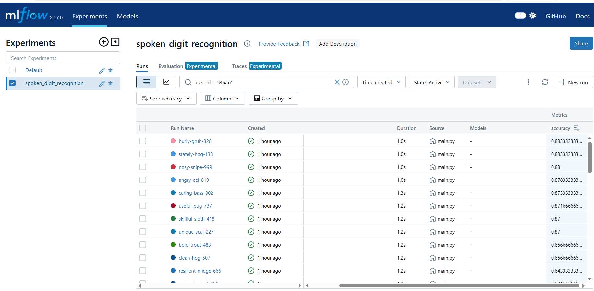
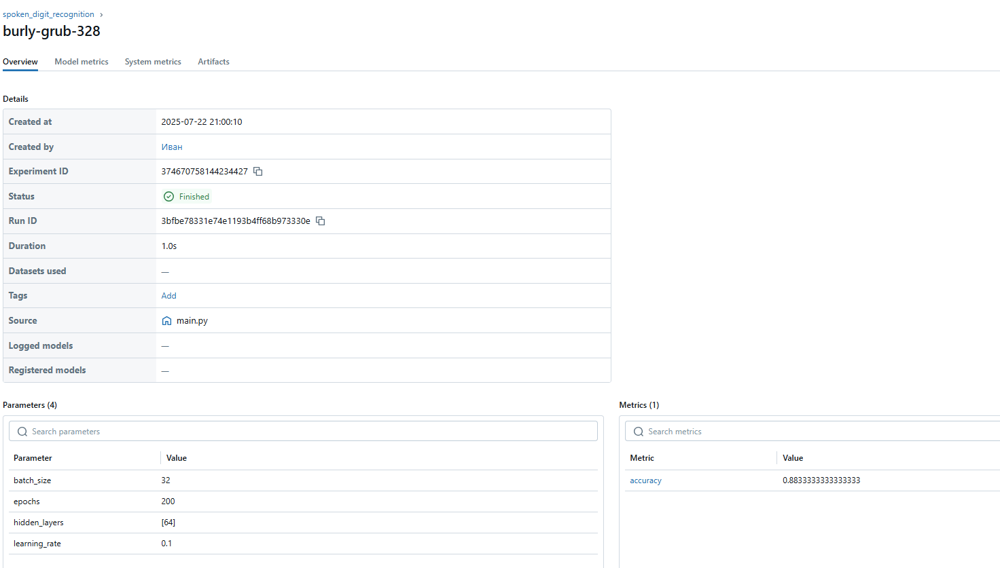

# Распознавание произнесенных цифр с помощью пользовательской нейронной сети

Этот проект реализует нейронную сеть с нуля для распознавания произнесенных цифр (0-9) из датасета Free Spoken Digit Dataset (FSDD). Сеть построена без использования библиотек машинного обучения, таких как TensorFlow или Keras, используя только NumPy для вычислений. AutoML используется для оптимизации гиперпараметров, а MLflow отслеживает эксперименты.

## Требования
- Python 3.8+
- Установите зависимости: `pip install -r requirements.txt`
- Скачайте датасет Free Spoken Digit Dataset и поместите его в `data/free-spoken-digit-dataset/`.

## Структура проекта
- `data/`: Содержит датасет FSDD.
- `src/`: Исходный код для обработки аудио, нейронной сети, AutoML, обучения и оценки.
- `main.py`: Главный скрипт для запуска конвейера.
- `requirements.txt`: Список зависимостей.

## Как запустить
1. Установите зависимости: `pip install -r requirements.txt`
2. Поместите датасет FSDD в `data/free-spoken-digit-dataset/`.
3. Запустите главный скрипт: `python main.py`
4. Просмотрите эксперименты MLflow: `mlflow ui` (доступно по адресу `http://localhost:5000`)

## Примечания
- Нейронная сеть использует MFCC-признаки, извлеченные с помощью `librosa`.
- AutoML выполняет поиск по сетке гиперпараметров: скорость обучения, конфигурации скрытых слоев, количество эпох и размер пакета.
- MLflow логирует параметры, метрики и запуски экспериментов.

## Изображения с MLflow

